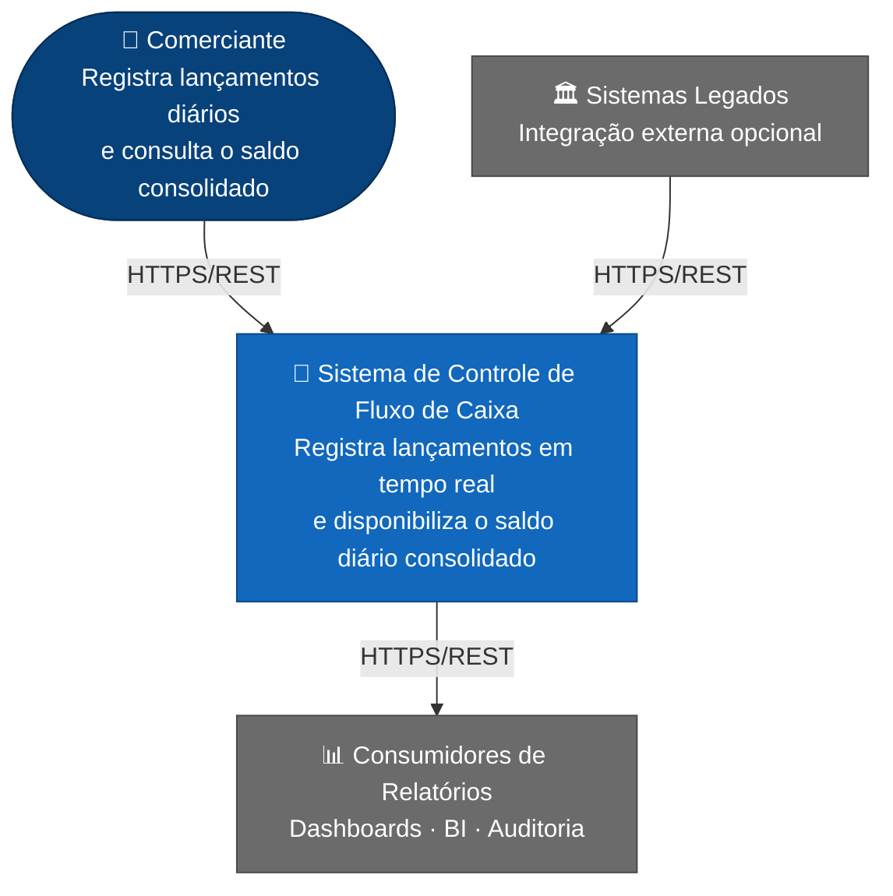
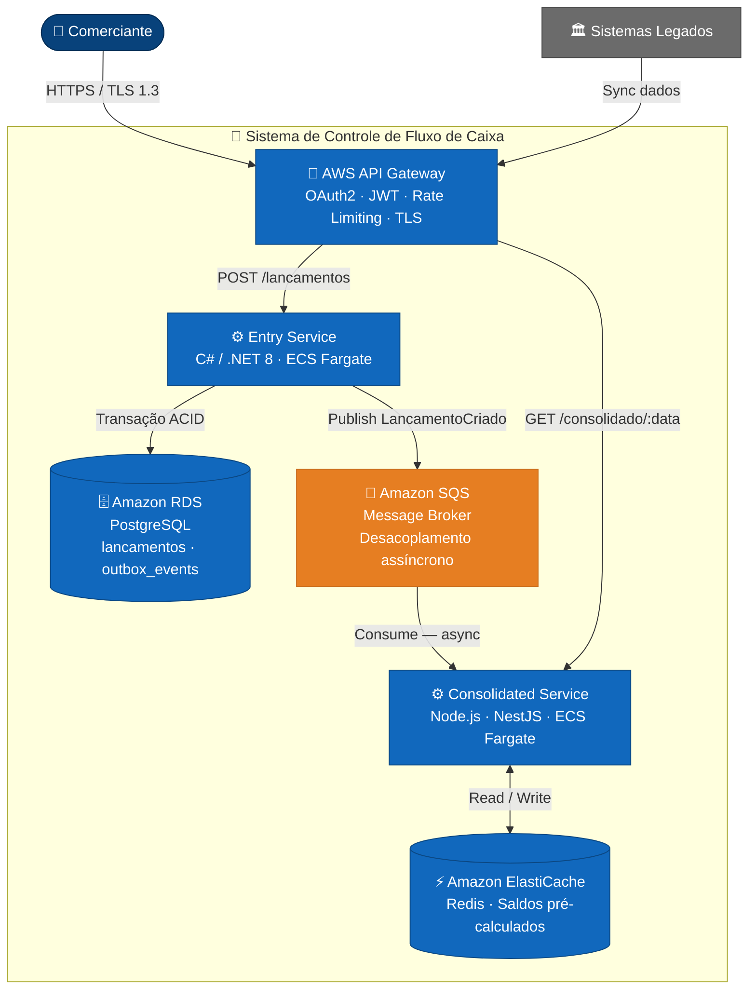
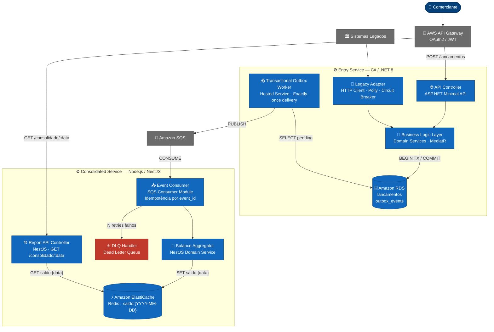
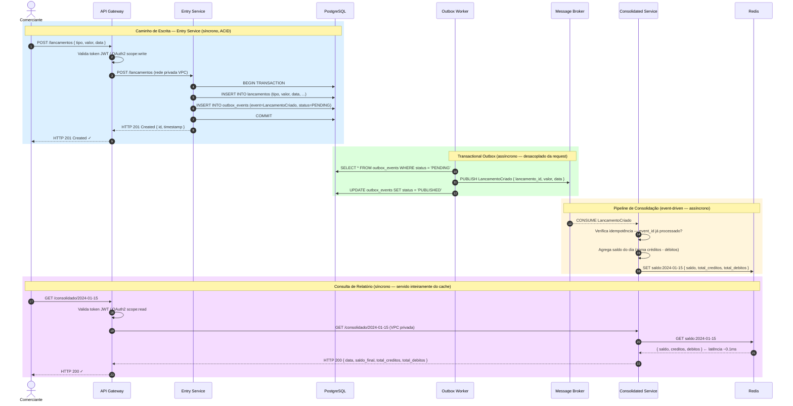

<div align="center">

# Sistema de Controle de Fluxo de Caixa

**Documentação de Arquitetura de Solução — Modelo C4**


*Arquitetura de alta disponibilidade e alto desempenho para controle transacional e consolidação analítica de fluxo de caixa diário*

</div>

---

## Sumário

- [Contexto de Negócio](#contexto-de-negócio)
- [Requisitos](#requisitos)
- [Visão Arquitetural](#visão-arquitetural)
- [Modelo C4](#modelo-c4)
  - [Nível 1 — Diagrama de Contexto](#nível-1--diagrama-de-contexto)
  - [Nível 2 — Diagrama de Containers](#nível-2--diagrama-de-containers)
  - [Nível 3 — Diagrama de Componentes](#nível-3--diagrama-de-componentes)
- [Fluxo de Dados — Jornada do Lançamento](#fluxo-de-dados--jornada-do-lançamento)
- [Padrões Arquiteturais](#padrões-arquiteturais)
- [Arquitetura de Segurança](#arquitetura-de-segurança)
- [Observabilidade](#observabilidade)
- [Infraestrutura e Custos](#infraestrutura-e-estimativa-de-custos-aws)
- [Estrutura do Repositório](#estrutura-do-repositório)

---

## Contexto de Negócio

Um comerciante precisa registrar continuamente lançamentos financeiros (débitos e créditos) ao longo do dia e, ao final de cada período, consultar um **relatório consolidado com o saldo diário atualizado**.

O desafio central da solução é garantir que o volume transacional de registros **nunca seja comprometido** por instabilidades no serviço de consolidação — e que as consultas ao relatório consigam atender **picos de até 50 requisições por segundo** com tolerância máxima de 5% de perda. Isso impõe uma separação estrutural obrigatória entre os caminhos de escrita e leitura, resolvida por uma **arquitetura orientada a eventos com CQRS**.

---

## Requisitos

### Requisitos Funcionais

| ID | Requisito |
|----|-----------|
| **RF-001** | Prover serviço para realizar e registrar lançamentos (débitos e créditos) |
| **RF-002** | Prover serviço para calcular e expor o consolidado diário com saldo atualizado |

### Requisitos Não-Funcionais

| ID | Requisito | Meta Quantitativa |
|----|-----------|-------------------|
| **RNF-001** | **Isolamento de Falhas** — o Entry Service não pode ser afetado pela queda do Consolidated Service | Disponibilidade independente por domínio |
| **RNF-002** | **Desempenho sob Pico** — o serviço de consolidado suporta picos de carga | ≥ 50 RPS sustentados |
| **RNF-003** | **Tolerância a Perdas** — perda de requisições de consolidado em pico | ≤ 5% |
| **RNF-004** | **Segurança e Integridade** — toda transação financeira usa canais protegidos | OAuth2 + JWT + TLS obrigatório |

---

## Visão Arquitetural

A solução adota uma **Arquitetura de Microsserviços orientada a eventos (Event-Driven Architecture)** com dois serviços especializados: um para o caminho de **escrita (Command)** e outro para o caminho de **leitura/consulta (Query)** — realizando o padrão **CQRS** com separação física de stores.

### Mapa de Decisões Técnicas

| Componente | Tecnologia Adotada | Justificativa Arquitetural |
|---|---|---|
| **Entry Service** | C# / .NET 8 | Alto throughput transacional; ecossistema robusto para regras de negócio críticas e integração com EF Core + Outbox |
| **Consolidated Service** | Node.js 20 / NestJS | I/O assíncrono intenso sem bloqueio de thread; NestJS provê estrutura modular alinhada a DDD |
| **Banco Transacional** | Amazon RDS for PostgreSQL | Garantias ACID rigorosas; suporte nativo a transações que combinam `lancamentos` e `outbox_events` em um único commit |
| **Message Broker** | Amazon SQS | Desacoplamento temporal total — mensagens persistem no broker mesmo com Consolidated Service offline, satisfazendo RNF-001 |
| **Cache de Relatórios** | Amazon ElastiCache for Redis | Latência sub-milissegundo para leituras; saldo pré-calculado responde a 50+ RPS sem pressão no banco, eliminando a perda de RNF-003 |
| **API Gateway** | AWS API Gateway | Ponto único de entrada para autenticação, rate limiting e TLS termination, sem lógica de negócio nos microsserviços |

### Domínios Funcionais (DDD)

```
╔═══════════════════════════════════════════════════════════╗
║  Core Domain — Lançamentos                                ║
║  ▸ Registrar créditos e débitos com integridade ACID      ║
║  ▸ Garantir isolamento de falhas (RNF-001)                ║
╠═══════════════════════════════════════════════════════════╣
║  Supporting Domain — Consolidação                         ║
║  ▸ Agregar lançamentos e calcular o balanço diário        ║
║  ▸ Suportar 50 RPS com perda ≤ 5% (RNF-002/003)           ║
╚═══════════════════════════════════════════════════════════╝
```

---

### Nível 1 — Diagrama de Contexto



**Atores e Sistemas Externos**

| Ator / Sistema | Tipo | Papel na Solução |
|---|---|---|
| **Comerciante** | Usuário Primário | Registra débitos/créditos ao longo do dia; consulta o saldo consolidado |
| **Sistemas Legados** | Sistema Externo | Fornece dados históricos para sincronização inicial (integração opcional) |
| **Consumidores de Relatórios** | Sistema Externo | Consome o consolidado para dashboards, BI, exportações e auditoria |

---

### Nível 2 — Diagrama de Containers



**Papéis dos Containers**

| Container | Runtime | Responsabilidade | Por que esta escolha |
|---|---|---|---|
| **API Gateway** | AWS API Gateway | AuthN/AuthZ, rate limiting, TLS, roteamento | Desacopla preocupações de segurança dos serviços de negócio |
| **Entry Service** | C# / .NET 8 — Amazon ECS Fargate | Registrar lançamentos; garantir atomicidade via Outbox | Alto throughput; Polly para resiliência; EF Core para Outbox |
| **PostgreSQL** | Amazon RDS for PostgreSQL | Persistência ACID de lançamentos e eventos Outbox | Único banco suportando 2 tabelas em uma transação atômica |
| **Message Broker** | Amazon SQS | Desacoplamento temporal entre escrita e consolidação | Se o Consolidated cair, mensagens persistem — RNF-001 satisfeito |
| **Consolidated Service** | Node.js / NestJS — Amazon ECS Fargate | Agregar saldos; expor relatório via cache | Event loop não-bloqueante ideal para consumo assíncrono |
| **Redis** | Amazon ElastiCache for Redis | Cache de saldos pré-calculados — latência ≤ 1ms | Elimina a perda em pico de 50 RPS — RNF-002/003 satisfeitos |

---

### Nível 3 — Diagrama de Componentes



---

## Fluxo de Dados — Jornada do Lançamento



**Garantias do Fluxo**

| Etapa | Garantia | Mecanismo |
|---|---|---|
| Registro do lançamento | Atomicidade total | Transação única no PostgreSQL (INSERT lancamento + outbox_event) |
| Publicação do evento | Exactly-once delivery | Transactional Outbox Worker com idempotência no consumidor |
| Atualização do saldo | Idempotência | Consolidated Service verifica `event_id` antes de processar |
| Resposta ao relatório | Latência ≤ 1ms | Redis serve 100% das consultas — zero hit no banco analítico |
| Tolerância à falha do Consolidated | Nenhum impacto no Entry Service | Broker persiste mensagens até o Consolidated voltar (RNF-001) |

---

## Padrões Arquiteturais

### Transactional Outbox

Resolve o problema de *dual-write*: garantir que a persistência do lançamento e a publicação do evento no broker ocorram **atomicamente** — eliminando o risco de publicar um evento para um lançamento que falhou (phantom event) ou de perder um evento de um lançamento persistido (silent loss).

```
┌─────────────────────────────────────────────────────────┐
│  Transação PostgreSQL                                   │
│                                                         │
│  INSERT INTO lancamentos  (valor, tipo, data)           │
│  INSERT INTO outbox_events (payload, status=PENDING)    │
│  COMMIT  ←──── atomicidade ACID garantida               │
└─────────────────────────────────────────────────────────┘
                          │
         Background Worker (Hosted Service)
                          │
         SELECT outbox_events WHERE status = PENDING
                          │
         PUBLISH → Message Broker
                          │
         UPDATE outbox_events SET status = PUBLISHED
```

### CQRS — Command Query Responsibility Segregation

| Responsabilidade | Serviço | Store | Consistência |
|---|---|---|---|
| **Command** (escrita) | Entry Service | PostgreSQL | Forte — ACID |
| **Query** (leitura) | Consolidated Service | Redis | Eventual — atualizado por evento |

A separação física dos stores elimina contenção entre leitura e escrita e permite escalar cada dimensão de forma independente.

### Circuit Breaker & Retry

Aplicado no **Legacy Adapter** (integração com sistemas legados) via **Polly** (.NET):

- **Retry Policy**: 3 tentativas com backoff exponencial (1s → 2s → 4s)
- **Circuit Breaker**: abre após 5 falhas consecutivas em 30 segundos; half-open após 60 segundos
- **Dead Letter Queue**: eventos não consumidos após N tentativas são isolados para reprocessamento manual ou auditoria, sem bloquear o pipeline principal

### Idempotência no Consumidor

O Consolidated Service mantém um registro de `event_id` já processados. Reenvios automáticos do broker (cenário de retry ou at-least-once delivery) não duplicam o cálculo do saldo — a operação é ignorada silenciosamente.

---

## Arquitetura de Segurança

```
Internet
    │
    ▼  TLS 1.3 obrigatório
┌─────────────────────────────────────────┐
│  API Gateway (Edge Layer)               │
│  ├── TLS 1.3 termination                │
│  ├── OAuth2 Authorization (JWT RS256)   │
│  ├── Rate Limiting por cliente          │
│  └── WAF — proteção contra OWASP Top 10 │
└──────────────────┬──────────────────────┘
                   │  VPC Privada — sem acesso público direto
       ┌───────────▼────────────┐
       │  Microsserviços        │
       │  Entry + Consolidated  │  ← comunicação interna por rede privada
       └───────────┬────────────┘
                   │  TLS nas conexões
       ┌───────────▼────────────┐
       │  Data Layer            │
       │  PostgreSQL + Redis    │  ← criptografia em repouso (AES-256, AWS KMS)
       └────────────────────────┘
```

| Camada | Mecanismo | Padrão / Protocolo |
|---|---|---|
| **Transporte** | TLS 1.3 em toda comunicação | HTTPS, Amazon ElastiCache TLS, Amazon SQS (HTTPS nativo) |
| **Autenticação** | OAuth2 + JWT assinado RS256 | RFC 6749 / RFC 7519 |
| **Autorização** | Scopes por operação (`scope:write`, `scope:read`) | RBAC via claims no token |
| **Dados em repouso** | Criptografia AES-256 | AWS KMS — RDS + ElastiCache |
| **Rede** | VPC isolada com subnets privadas | AWS VPC / Security Groups |
| **Auditoria** | Log estruturado JSON de cada transação | Amazon CloudWatch Logs + AWS X-Ray traces |

---

## Observabilidade

A solução adota os **três pilares de observabilidade** via **OpenTelemetry**, com rastreabilidade ponta-a-ponta de cada lançamento — desde a requisição HTTP até a gravação do saldo no Redis.

```
                 OpenTelemetry Collector
                           │
         ┌─────────────────┼─────────────────┐
         ▼                 ▼                 ▼
   ┌────────────┐    ┌─────────────┐   ┌──────────────┐
   │  Métricas  │    │    Logs     │   │    Traces    │
   │ CloudWatch │    │ CloudWatch  │   │   AWS X-Ray  │
   │  Metrics + │    │    Logs     │   │              │
   │ Dashboards │    │ (JSON str.) │   │              │
   └────────────┘    └─────────────┘   └──────────────┘
```

| Pilar | Ferramenta | Sinais Monitorados |
|---|---|---|
| **Métricas** | Amazon CloudWatch Metrics + Dashboards | Taxa de lançamentos/s, latência P50/P95/P99, RPS do consolidado, hit rate do ElastiCache, fila do SQS |
| **Logs** | Amazon CloudWatch Logs (JSON estruturado) | Cada lançamento registrado, falhas de consumo, eventos na DLQ, erros de validação e autenticação |
| **Traces** | AWS X-Ray | Rastreamento distribuído: HTTP → Entry → Amazon SQS → Consolidated → ElastiCache |

**Alertas Críticos Recomendados**

| Alerta | Threshold | Impacto |
|---|---|---|
| Latência P95 do Entry Service | > 200ms | Degradação na experiência de registro |
| Taxa de erros no Consolidated | > 1% | Saldo consolidado pode ficar desatualizado |
| Fila do Amazon SQS | > 1.000 mensagens visíveis | Pipeline de consolidação atrasado |
| Cache miss rate do Redis | > 10% | Latência de leitura aumenta — risco de RNF-002/003 |
| Eventos na DLQ | > 0 | Indica falha não tratada no consumo — requer atenção imediata |

---

## Infraestrutura e Estimativa de Custos AWS

### Topologia AWS Target

```
                        ┌───────────────────────────────────────────┐
                        │              AWS Cloud                    │
                        │                                           │
  Comerciante ──HTTPS──►│  AWS API Gateway  (Edge / Auth / TLS)     │
                        │          │                                │
                        │    ┌─────▼────────────────────────┐       │
                        │    │     Amazon ECS Fargate       │       │
                        │    │  ┌──────────┐ ┌────────────┐ │       │
                        │    │  │  Entry   │ │Consolidated│ │       │
                        │    │  │ Service  │ │  Service   │ │       │
                        │    │  └────┬─────┘ └──────┬─────┘ │       │
                        │    └───────┼──────────────┼───────┘       │
                        │    ┌───────▼────┐   ┌─────▼──────┐        │
                        │    │ Amazon RDS │   │ ElastiCache│        │
                        │    │ PostgreSQL │   │   Redis    │        │
                        │    └────────────┘   └────────────┘        │
                        │                                           │
                        │    ┌──────────────────────────────────┐   │
                        │    │           Amazon SQS             │   │
                        │    └──────────────────────────────────┘   │
                        │                                           │
                        │    CloudWatch · X-Ray · KMS · VPC         │
                        └───────────────────────────────────────────┘
```

### Estimativa de Custos Mensais

| Serviço AWS | Dimensionamento | Custo/mês (USD) |
|---|---|---|
| **Amazon ECS Fargate** | 2 tasks × 2 serviços (0.5 vCPU / 1 GB RAM) — Alta Disponibilidade | ~$ 30,00 |
| **Amazon RDS PostgreSQL** | db.t3.micro — SSD 20 GB — Multi-AZ opcional | ~$ 20,00 |
| **Amazon SQS** | Mensageria serverless — pay-per-use (por mensagem) | ~$ 5,00 |
| **Amazon ElastiCache (Redis)** | cache.t3.micro — suporte a 50+ RPS | ~$ 15,00 |
| **AWS API Gateway** | REST API — até 1M req/mês no free tier | ~$ 3,50 |
| **CloudWatch + X-Ray + KMS** | Logs, métricas, traces e criptografia | ~$ 10,00 |
| **Total Estimado** | | **~$ 83,50 / mês** |

> Custos estimados para ambiente de produção com carga moderada. Auto-scaling do ECS Fargate e elasticidade do SQS absorvem picos sem custo fixo adicional significativo.

---

## Estrutura do Repositório

Organização **monorepo** recomendada para acomodar os dois microsserviços, infraestrutura e documentação em um único repositório versionado:

```
verx-cash-flow/
├── entry-service/                    # Microsserviço de Controle de Lançamentos
│   ├── src/
│   │   ├── Controllers/              # ASP.NET Minimal API — endpoints REST
│   │   ├── Domain/                   # Entidades, Value Objects e Regras de Negócio
│   │   ├── Application/              # Use Cases e MediatR Command Handlers
│   │   └── Infrastructure/           # EF Core, PostgreSQL, Outbox Worker, Polly
│   ├── tests/
│   │   ├── Unit/
│   │   └── Integration/
│   └── Dockerfile
│
├── consolidated-service/             # Microsserviço do Consolidado Diário
│   ├── src/
│   │   ├── controllers/              # NestJS REST Controllers
│   │   ├── domain/                   # Aggregators, Balance Calculator
│   │   ├── application/              # NestJS Services e Event Handlers
│   │   └── infrastructure/           # ioredis, Amazon SQS consumer, DLQ Handler
│   ├── tests/
│   │   ├── unit/
│   │   └── integration/
│   └── Dockerfile
│
├── architecture-docs/                # Diagramas C4, ADRs e especificações
│   ├── adr/                          # Architecture Decision Records
│   ├── c4/                           # Fontes dos diagramas (PlantUML / Mermaid)
│   └── desafio-arquiteto-solucoes.pdf
│
├── infra/                            # Infrastructure as Code
│   ├── terraform/                    # AWS: ECS, RDS, ElastiCache, SQS, API GW
│   └── docker-compose.yml            # Stack local completa
│
└── README.md
```

**Execução local com um único comando:**

```bash
docker compose up
```

Inicializa Entry Service, Consolidated Service, PostgreSQL, Redis e Message Broker com configurações de desenvolvimento pré-definidas — pronto para validação funcional e testes integrados.

---

<div align="center">

*Arquitetura projetada para isolar falhas por domínio, escalar de forma independente e garantir rastreabilidade total de cada centavo lançado.*

</div>
